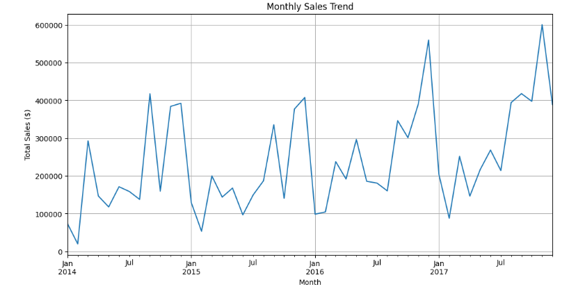
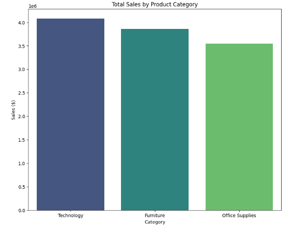
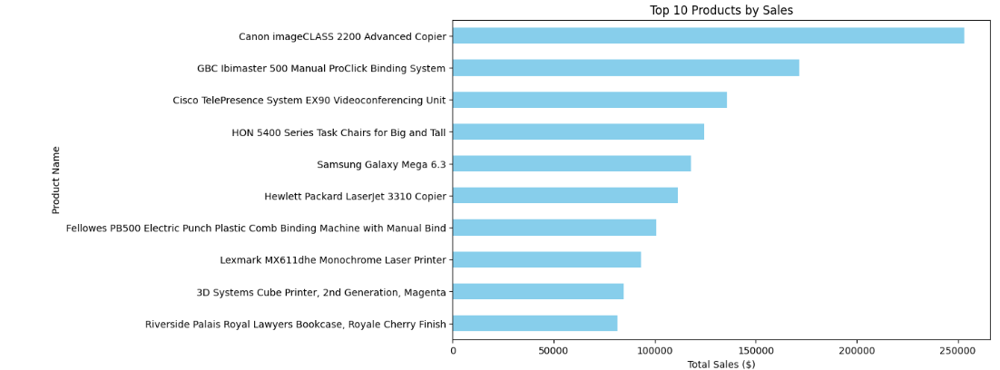
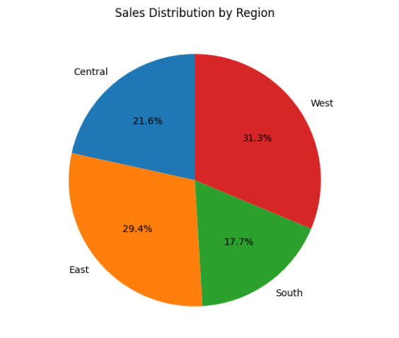

# 📊 Sales Performance Analysis - E-Commerce Retail Store

This project analyzes sales data from a fictional    e-commerce superstore to uncover trends, identify top products, and provide actionable business insights  all using **Python** and **data visualization tools**.

---
## 🎯 Project Goals

- Clean and explore real-world sales data
- Visualize sales trends and patterns
- Identify best-selling products and regions
- Recommend business strategies based on data

---

## 🧠 Key Skills Demonstrated

- Data Cleaning with **Pandas**
- Data Visualization with **Matplotlib** and **Seaborn**
- Exploratory Data Analysis (EDA)
- Business Insight Generation
- Jupyter Notebook Workflow

---

## 📈 Key Insights

✅ **Top-Selling Product Category**: Technology  
✅ **Best Performing Region**: West  
✅ **Peak Sales Time**: November & December (Holiday Season)  
✅ **Most Profitable Items**: Copiers, Machines  
✅ **Low-Profit Items**: Tables, Bookcases  

---

## 🖼️ Sample Visualizations

### Monthly Sales Trend

### Sales by Category

### Top 10 Products

### Sales by Region

---
## 🛠️ How to View This Project

1. **Download or clone** this project folder to your computer
2. Open the file `notebooks/Sales_Analysis.ipynb` using:
   - **Jupyter Notebook**
   - **JupyterLab**
   - **VS Code** (with Python/Jupyter extension)
3. Run the notebook to see the full analysis and visualizations

---

